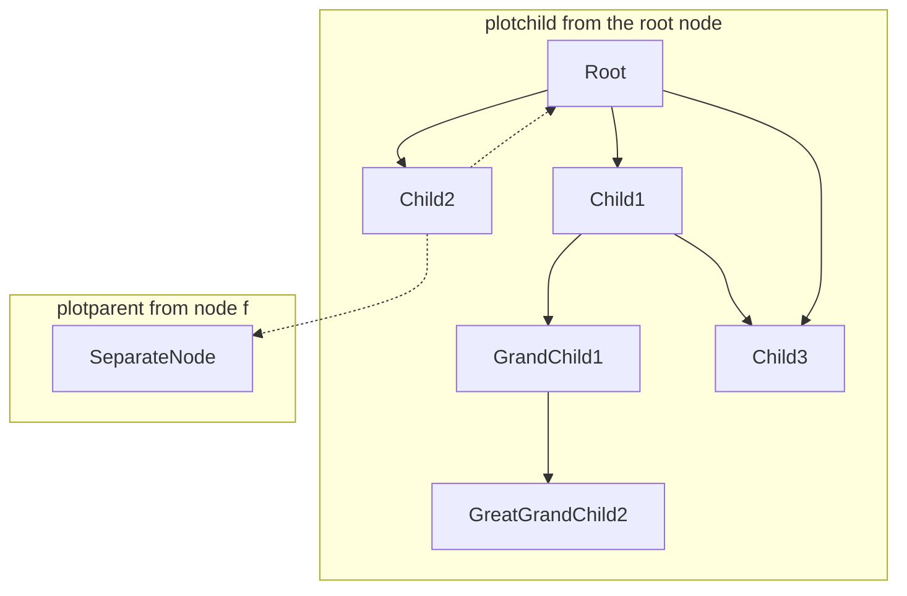

```mermaid
graph
subgraph plotchild from the root node
Root --> Child1
Child1 --> GrandChild1
GrandChild1 --> GreatGrandChild2
Child1 --> Child3
Root --> Child3
Root --> Child2
end
subgraph plotparent from node f
Child2 -.-> SeparateNode
Child2 -.-> Root
end
```
