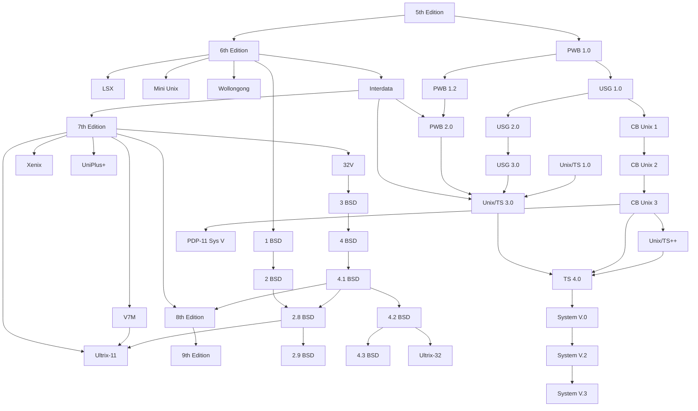

```mermaid
graph TD

64ae9d41-b072-4fa9-9e91-cbc1d9b14bd6["5th Edition"] --> f603927e-e6b3-42cb-ad39-ef75c70ea3d6["6th Edition"]
64ae9d41-b072-4fa9-9e91-cbc1d9b14bd6["5th Edition"] --> b33dc331-fff8-47b8-8a47-10356b60bf94["PWB 1.0"]
f603927e-e6b3-42cb-ad39-ef75c70ea3d6["6th Edition"] --> 5e5acf4c-d14c-46ee-a5c5-e95f9708f34a["LSX"]
f603927e-e6b3-42cb-ad39-ef75c70ea3d6["6th Edition"] --> ff614470-ede6-499d-abe7-cc60732bed55["1 BSD"]
f603927e-e6b3-42cb-ad39-ef75c70ea3d6["6th Edition"] --> 5e8481bd-4373-4b75-9995-9f68af447c32["Mini Unix"]
f603927e-e6b3-42cb-ad39-ef75c70ea3d6["6th Edition"] --> 3446f0f0-9e16-4334-8a7e-5ca56f5f6e1e["Wollongong"]
f603927e-e6b3-42cb-ad39-ef75c70ea3d6["6th Edition"] --> 4557e491-d9ff-450f-9f67-858b677d92f5["Interdata"]
b33dc331-fff8-47b8-8a47-10356b60bf94["PWB 1.0"] --> 91e9207a-cd3f-4fbb-a8b1-4ef09b294d35["PWB 1.2"]
b33dc331-fff8-47b8-8a47-10356b60bf94["PWB 1.0"] --> 05f3f555-f89a-47a3-ba92-d3818789f5e6["USG 1.0"]
ff614470-ede6-499d-abe7-cc60732bed55["1 BSD"] --> a231a99a-ec15-456b-9a36-715353d56358["2 BSD"]
4557e491-d9ff-450f-9f67-858b677d92f5["Interdata"] --> de800ed7-c46c-4666-b75e-dedb19c320b8["Unix/TS 3.0"]
4557e491-d9ff-450f-9f67-858b677d92f5["Interdata"] --> d0573f88-4c71-4fbd-a44b-40d2157e43f1["PWB 2.0"]
4557e491-d9ff-450f-9f67-858b677d92f5["Interdata"] --> 5b219878-f0ff-4061-bb0e-e504edb56c6c["7th Edition"]
de800ed7-c46c-4666-b75e-dedb19c320b8["Unix/TS 3.0"] --> 339d8a76-3324-43b7-9f5e-53f62309f7a4["TS 4.0"]
d0573f88-4c71-4fbd-a44b-40d2157e43f1["PWB 2.0"] --> de800ed7-c46c-4666-b75e-dedb19c320b8["Unix/TS 3.0"]
5b219878-f0ff-4061-bb0e-e504edb56c6c["7th Edition"] --> 99a42443-90a9-4a10-b415-da80a0c6a775["8th Edition"]
5b219878-f0ff-4061-bb0e-e504edb56c6c["7th Edition"] --> 609f005c-40e3-4a1b-829c-3c09e6851b1d["32V"]
5b219878-f0ff-4061-bb0e-e504edb56c6c["7th Edition"] --> 7c9290af-fefd-4f31-b72e-eba04ffd009e["V7M"]
5b219878-f0ff-4061-bb0e-e504edb56c6c["7th Edition"] --> 41ed7427-abaa-4d4f-b1b5-708802b335ea["Ultrix-11"]
5b219878-f0ff-4061-bb0e-e504edb56c6c["7th Edition"] --> 18065251-0f3e-4f87-b5c8-fae1ce109c76["Xenix"]
5b219878-f0ff-4061-bb0e-e504edb56c6c["7th Edition"] --> b12ab633-233b-4baa-81ec-0aaed23aece2["UniPlus+"]
99a42443-90a9-4a10-b415-da80a0c6a775["8th Edition"] --> 6498adf0-0242-4b0f-ad14-598ee051d483["9th Edition"]
609f005c-40e3-4a1b-829c-3c09e6851b1d["32V"] --> a8034216-087b-4357-a128-efd4d0b383f9["3 BSD"]
7c9290af-fefd-4f31-b72e-eba04ffd009e["V7M"] --> 41ed7427-abaa-4d4f-b1b5-708802b335ea["Ultrix-11"]
a231a99a-ec15-456b-9a36-715353d56358["2 BSD"] --> 0c8b8ef3-a263-4bd9-b28e-0d1a10f9a98e["2.8 BSD"]
0c8b8ef3-a263-4bd9-b28e-0d1a10f9a98e["2.8 BSD"] --> 41ed7427-abaa-4d4f-b1b5-708802b335ea["Ultrix-11"]
0c8b8ef3-a263-4bd9-b28e-0d1a10f9a98e["2.8 BSD"] --> 47b6dc99-5c4d-4c21-b0b8-f502572e7694["2.9 BSD"]
a8034216-087b-4357-a128-efd4d0b383f9["3 BSD"] --> 5cb8bb94-f960-4cea-838b-0134db70d72c["4 BSD"]
5cb8bb94-f960-4cea-838b-0134db70d72c["4 BSD"] --> 1d8ee0f1-0e18-4353-9da3-3d76d1807b1e["4.1 BSD"]
1d8ee0f1-0e18-4353-9da3-3d76d1807b1e["4.1 BSD"] --> ba014d4d-eb56-477f-acd8-cd2b9de0f6fb["4.2 BSD"]
1d8ee0f1-0e18-4353-9da3-3d76d1807b1e["4.1 BSD"] --> 0c8b8ef3-a263-4bd9-b28e-0d1a10f9a98e["2.8 BSD"]
1d8ee0f1-0e18-4353-9da3-3d76d1807b1e["4.1 BSD"] --> 99a42443-90a9-4a10-b415-da80a0c6a775["8th Edition"]
ba014d4d-eb56-477f-acd8-cd2b9de0f6fb["4.2 BSD"] --> 692c64c7-5bbb-4e45-90a1-af747c5a91d6["4.3 BSD"]
ba014d4d-eb56-477f-acd8-cd2b9de0f6fb["4.2 BSD"] --> adc41e63-56b4-435a-aec4-d674f3be35dc["Ultrix-32"]
91e9207a-cd3f-4fbb-a8b1-4ef09b294d35["PWB 1.2"] --> d0573f88-4c71-4fbd-a44b-40d2157e43f1["PWB 2.0"]
05f3f555-f89a-47a3-ba92-d3818789f5e6["USG 1.0"] --> ec8d9735-58cb-4fe1-a7f0-e6bff0ff795e["CB Unix 1"]
05f3f555-f89a-47a3-ba92-d3818789f5e6["USG 1.0"] --> 54e55a3e-b636-4b3a-b9ac-e6b8233204a6["USG 2.0"]
ec8d9735-58cb-4fe1-a7f0-e6bff0ff795e["CB Unix 1"] --> 848fc073-4375-4098-ba0d-a0a3eee6ccae["CB Unix 2"]
54e55a3e-b636-4b3a-b9ac-e6b8233204a6["USG 2.0"] --> 9ff383b5-4727-4953-9f57-168d28dc028c["USG 3.0"]
848fc073-4375-4098-ba0d-a0a3eee6ccae["CB Unix 2"] --> 41fc5c77-913e-4c05-9583-b831720d8d7d["CB Unix 3"]
41fc5c77-913e-4c05-9583-b831720d8d7d["CB Unix 3"] --> 7e512947-7458-484c-9a38-486d019e2240["Unix/TS++"]
41fc5c77-913e-4c05-9583-b831720d8d7d["CB Unix 3"] --> cc32fe24-1399-4457-b65b-7340f117af0f["PDP-11 Sys V"]
41fc5c77-913e-4c05-9583-b831720d8d7d["CB Unix 3"] --> 339d8a76-3324-43b7-9f5e-53f62309f7a4["TS 4.0"]
7e512947-7458-484c-9a38-486d019e2240["Unix/TS++"] --> 339d8a76-3324-43b7-9f5e-53f62309f7a4["TS 4.0"]
9ff383b5-4727-4953-9f57-168d28dc028c["USG 3.0"] --> de800ed7-c46c-4666-b75e-dedb19c320b8["Unix/TS 3.0"]
1af83044-b841-4d78-b1d4-505fa24d287b["Unix/TS 1.0"] --> de800ed7-c46c-4666-b75e-dedb19c320b8["Unix/TS 3.0"]
339d8a76-3324-43b7-9f5e-53f62309f7a4["TS 4.0"] --> caa2483c-2faf-4160-a2e9-b118b0dfea07["System V.0"]
caa2483c-2faf-4160-a2e9-b118b0dfea07["System V.0"] --> 66fbe042-6f23-4b01-a9f2-00a750b0d49a["System V.2"]
66fbe042-6f23-4b01-a9f2-00a750b0d49a["System V.2"] --> 94310994-7cbb-4dda-945c-c0cb5f90164b["System V.3"]
```
